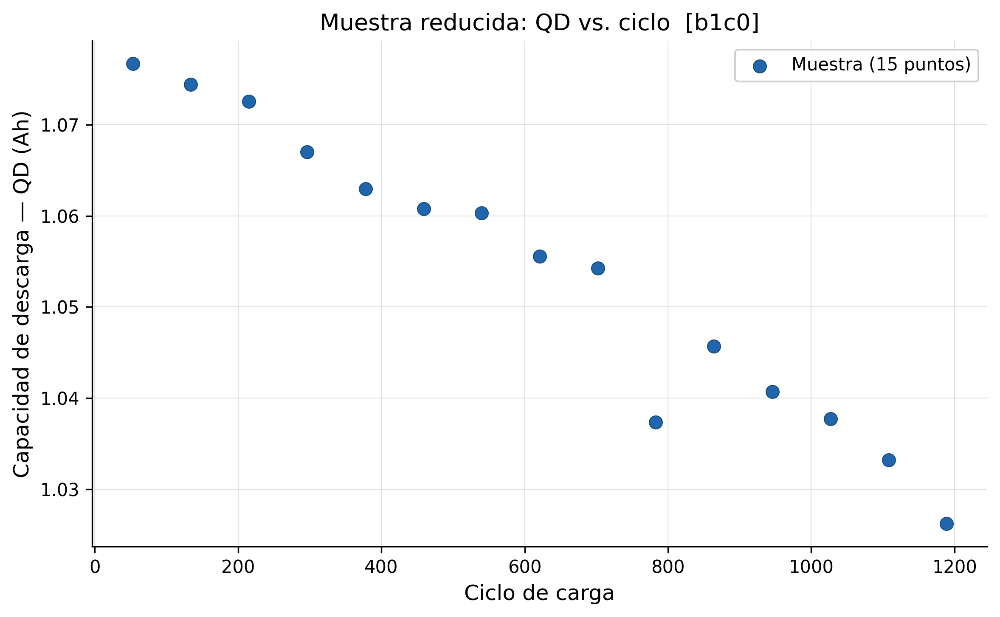
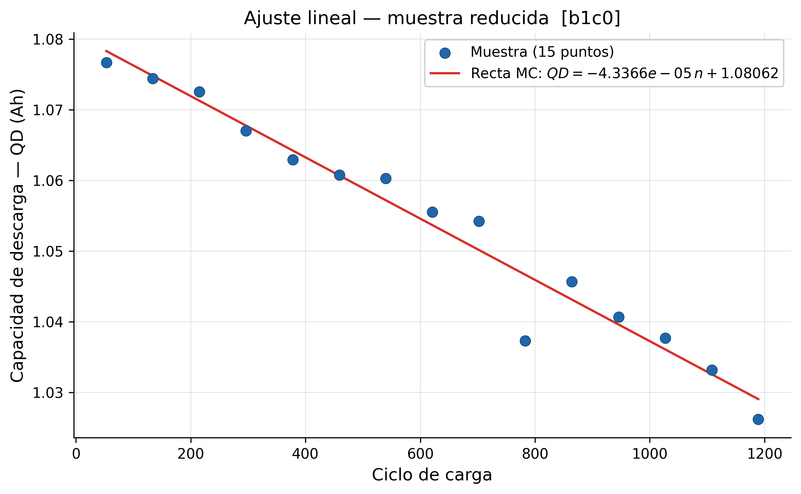
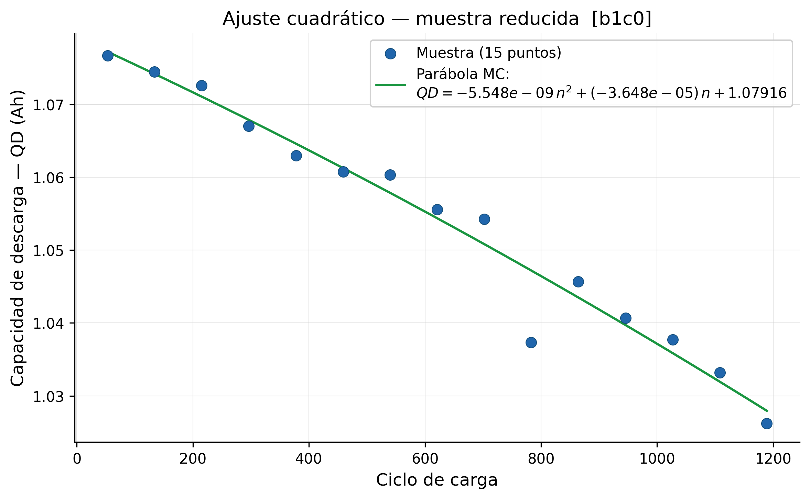
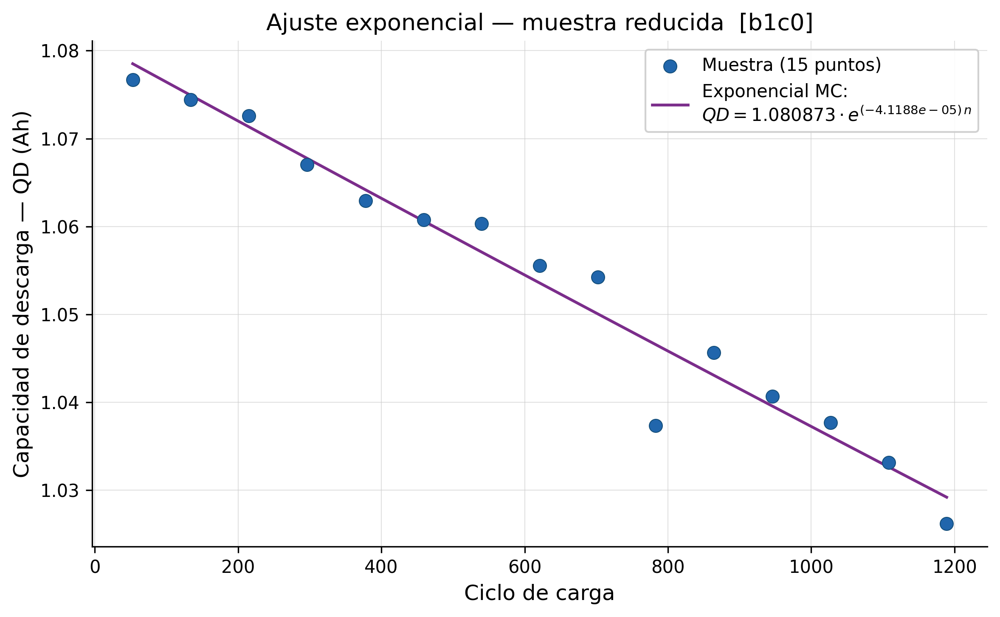
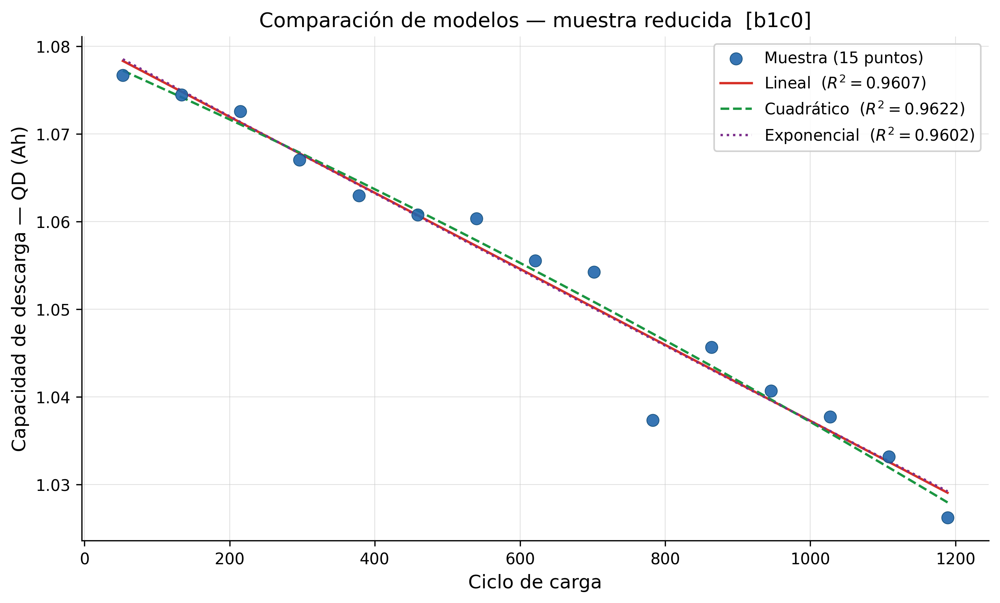

# Aproximación por mínimos cuadrados — Muestra reducida

**Materia:** Análisis Numérico  
**Dataset:** Ciclado de baterías de litio-ion (`b1c0`)  
**Variables:** Número de ciclo de carga (n) y capacidad de descarga (QD)

> **Nota sobre este documento:** el estudio completo con los 1 120 puntos de la fase de degradación se encuentra en [README.md](README.md). Este documento repite el mismo análisis sobre una **muestra reducida de 15 puntos** para que las curvas de ajuste y la curvatura de cada modelo sean visualmente distinguibles.

---

## a) Selección de la muestra

De los 1 120 puntos de la fase de degradación (ciclos 53–1189), se seleccionaron **15 puntos equidistantes** tomando el dato real más cercano a cada uno de los 15 valores objetivo uniformemente distribuidos en el intervalo:

$$n_k = 53 + (k-1) \cdot \frac{1189-53}{14}, \quad k = 1, 2, \ldots, 15$$

| $i$ | Ciclo ($n$) | QD (Ah) |
|-----|------------|---------|
| 1   | 53         | 1,076701 |
| 2   | 134        | 1,074445 |
| 3   | 215        | 1,072575 |
| 4   | 296        | 1,067037 |
| 5   | 378        | 1,062948 |
| 6   | 459        | 1,060768 |
| 7   | 540        | 1,060317 |
| 8   | 621        | 1,055551 |
| 9   | 702        | 1,054232 |
| 10  | 783        | 1,037337 |
| 11  | 864        | 1,045661 |
| 12  | 946        | 1,040701 |
| 13  | 1027       | 1,037714 |
| 14  | 1108       | 1,033182 |
| 15  | 1189       | 1,026210 |

---

## b) Nube de puntos

---

## c) Modelos de aproximación

### Modelo 1 — Recta de mínimos cuadrados

$$QD(n) = a \cdot n + b$$

**Ecuaciones normales** (sistema 2×2):

$$\begin{cases} a \cdot \sum x^2 + b \cdot \sum x = \sum x\,f(x) \\ a \cdot \sum x \;\;\; + b \cdot n \;\;\;\; = \sum f(x) \end{cases}$$

**Tabla de sumas:**

| $i$ | $x$ | $f(x)$ | $x^2$ | $x \cdot f(x)$ |
|-----|-----|--------|-------|----------------|
| 1 | 53 | 1,076701 | 2 809 | 57,065148 |
| 2 | 134 | 1,074445 | 17 956 | 143,975643 |
| 3 | 215 | 1,072575 | 46 225 | 230,603646 |
| 4 | 296 | 1,067037 | 87 616 | 315,843011 |
| 5 | 378 | 1,062948 | 142 884 | 401,794420 |
| 6 | 459 | 1,060768 | 210 681 | 486,892512 |
| 7 | 540 | 1,060317 | 291 600 | 572,571288 |
| 8 | 621 | 1,055551 | 385 641 | 655,496985 |
| 9 | 702 | 1,054232 | 492 804 | 740,070513 |
| 10 | 783 | 1,037337 | 613 089 | 812,235028 |
| 11 | 864 | 1,045661 | 746 496 | 903,450672 |
| 12 | 946 | 1,040701 | 894 916 | 984,502957 |
| 13 | 1027 | 1,037714 | 1 054 729 | 1 065,732073 |
| 14 | 1108 | 1,033182 | 1 227 664 | 1 144,765434 |
| 15 | 1189 | 1,026210 | 1 413 721 | 1 220,163452 |
| **Σ** | **9 315** | **15,805378** | **7 628 831** | **9 735,162782** |

**Sistema con valores numéricos:**

$$\begin{cases} 7\,628\,831\,a + 9\,315\,b = 9\,735{,}162782 \\ 9\,315\,a + 15\,b = 15{,}805378 \end{cases}$$

**Resolución — Regla de Cramer:**

$$\det(A) = n \cdot \sum x^2 - \left(\sum x\right)^2 = 15 \cdot 7\,628\,831 - 9\,315^2 = 27\,663\,240$$

$$a = \frac{n \cdot \sum x f(x) - \sum x \cdot \sum f(x)}{\det(A)} = \frac{15 \cdot 9\,735{,}1628 - 9\,315 \cdot 15{,}8054}{27\,663\,240} = \frac{-1\,199{,}6525}{27\,663\,240}$$

$$a = -4{,}3366 \times 10^{-5}$$

$$b = \frac{\sum f(x) - a \cdot \sum x}{n} = \frac{15{,}8054 - (-4{,}3366\times10^{-5}) \cdot 9\,315}{15} = 1{,}08062$$

**Resultado:**

$$\boxed{QD(n) = -4{,}3366 \times 10^{-5} \cdot n + 1{,}08062}$$

$$QD(1300) = -4{,}3366\times10^{-5} \cdot 1300 + 1{,}08062 \approx 1{,}0243 \text{ Ah}$$

---

### Modelo 2 — Parábola de mínimos cuadrados

$$QD(n) = a \cdot n^2 + b \cdot n + c$$

**Ecuaciones normales** (sistema 3×3):

$$\begin{pmatrix} \sum x^4 & \sum x^3 & \sum x^2 \\ \sum x^3 & \sum x^2 & \sum x \\ \sum x^2 & \sum x & n \end{pmatrix} \begin{pmatrix} a \\ b \\ c \end{pmatrix} = \begin{pmatrix} \sum x^2 f(x) \\ \sum x\,f(x) \\ \sum f(x) \end{pmatrix}$$

**Tabla de sumas:**

| $i$ | $x$ | $f(x)$ | $x^2$ | $x^3$ | $x^4$ | $x \cdot f(x)$ | $x^2 \cdot f(x)$ |
|-----|-----|--------|-------|-------|-------|----------------|------------------|
| 1 | 53 | 1,076701 | 2 809 | 148 877 | 7 890 481 | 57,065148 | 3 024,453 |
| 2 | 134 | 1,074445 | 17 956 | 2 406 104 | 322 417 936 | 143,975643 | 19 292,736 |
| 3 | 215 | 1,072575 | 46 225 | 9 938 375 | 2 136 750 625 | 230,603646 | 49 579,784 |
| 4 | 296 | 1,067037 | 87 616 | 25 934 336 | 7 676 563 456 | 315,843011 | 93 489,531 |
| 5 | 378 | 1,062948 | 142 884 | 54 010 152 | 20 415 837 456 | 401,794420 | 151 878,291 |
| 6 | 459 | 1,060768 | 210 681 | 96 702 579 | 44 386 483 761 | 486,892512 | 223 483,663 |
| 7 | 540 | 1,060317 | 291 600 | 157 464 000 | 85 030 560 000 | 572,571288 | 309 188,496 |
| 8 | 621 | 1,055551 | 385 641 | 239 483 061 | 148 718 980 881 | 655,496985 | 407 063,627 |
| 9 | 702 | 1,054232 | 492 804 | 345 948 408 | 242 855 782 416 | 740,070513 | 519 529,500 |
| 10 | 783 | 1,037337 | 613 089 | 480 048 687 | 375 878 121 921 | 812,235028 | 635 980,027 |
| 11 | 864 | 1,045661 | 746 496 | 644 972 544 | 557 256 278 016 | 903,450672 | 780 581,381 |
| 12 | 946 | 1,040701 | 894 916 | 846 590 536 | 800 874 647 056 | 984,502957 | 931 339,797 |
| 13 | 1027 | 1,037714 | 1 054 729 | 1 083 206 683 | 1 112 453 263 441 | 1 065,732073 | 1 094 506,839 |
| 14 | 1108 | 1,033182 | 1 227 664 | 1 360 251 712 | 1 507 158 896 896 | 1 144,765434 | 1 268 400,101 |
| 15 | 1189 | 1,026210 | 1 413 721 | 1 680 914 269 | 1 998 607 065 841 | 1 220,163452 | 1 450 774,345 |
| **Σ** | **9 315** | **15,805378** | **7 628 831** | **7 028 020 323** | **6 903 779 540 183** | **9 735,162782** | **7 938 112,570** |

**Sistema con valores numéricos:**

$$6{,}9038\times10^{12}\,a \ + \ 7{,}0280\times10^{9}\,b \ + \ 7{,}6288\times10^{6}\,c \ = \ 7{,}9381\times10^{6}$$
$$7{,}0280\times10^{9}\,a \ + \ 7{,}6288\times10^{6}\,b \ + \ 9315\,c \ = \ 9735{,}1628$$
$$7{,}6288\times10^{6}\,a \ + \ 9315\,b \ + \ 15\,c \ = \ 15{,}8054$$

**Resolución: reducción a sistema 2×2 + Regla de Cramer**

**Paso 1 — Despejar $c$ de la ecuación 3:**

$$c = \frac{\sum f(x) - \sum x^2 \cdot a - \sum x \cdot b}{n}$$

**Paso 2 — Sustituir en la ecuación 2** (×n):

$$\alpha = n\sum x^3 - \sum x^2 \sum x = 15 \cdot 7\,028\,020\,323 - 7\,628\,831 \cdot 9\,315 = 34\,357\,744\,080$$

$$\beta = n\sum x^2 - \left(\sum x\right)^2 = 27\,663\,240 \quad \text{(= det lineal)}$$

$$\gamma = n\sum x f(x) - \sum f(x)\sum x = 15 \cdot 9\,735{,}1628 - 15{,}8054 \cdot 9\,315 = -1\,199{,}6525$$

$$\Rightarrow \text{ecuación (A):} \quad \alpha\,a + \beta\,b = \gamma$$

**Paso 3 — Sustituir en la ecuación 1** (×n):

$$\alpha' = n\sum x^4 - \left(\sum x^2\right)^2 = 15 \cdot 6\,903\,779\,540\,183 - (7\,628\,831)^2 = 4{,}5358\times10^{13}$$

$$\beta' = \alpha = 34\,357\,744\,080 \quad \text{(simetría de la matriz normal)}$$

$$\gamma' = n\sum x^2 f(x) - \sum f(x)\sum x^2 = 15 \cdot 7\,938\,112{,}570 - 15{,}8054 \cdot 7\,628\,831 = -1\,504\,867{,}577$$

$$\Rightarrow \text{ecuación (B):} \quad \alpha'\,a + \alpha\,b = \gamma'$$

**Paso 4 — Sistema 2×2 resultante:**

$$\begin{pmatrix} 3{,}4358\times10^{10} & 2{,}7663\times10^{7} \\ 4{,}5358\times10^{13} & 3{,}4358\times10^{10} \end{pmatrix} \begin{pmatrix} a \\ b \end{pmatrix} = \begin{pmatrix} -1\,199{,}6525 \\ -1\,504\,867{,}577 \end{pmatrix}$$

**Paso 5 — Regla de Cramer sobre el sistema 2×2:**

$$\det(A_2) = \alpha^2 - \alpha'\,\beta = (3{,}4358\times10^{10})^2 - (4{,}5358\times10^{13})(2{,}7663\times10^{7}) = -7{,}4284\times10^{19}$$

$$a = \frac{\gamma\,\alpha - \gamma'\,\beta}{\det(A_2)} = \frac{4{,}1216\times10^{11}}{-7{,}4284\times10^{19}} = -5{,}5484\times10^{-9}$$

$$b = \frac{\alpha\,\gamma' - \alpha'\,\gamma}{\det(A_2)} = \frac{2{,}7095\times10^{15}}{-7{,}4284\times10^{19}} = -3{,}6475\times10^{-5}$$

**Paso 6 — Recuperar $c$:**

$$c = \frac{15{,}8054 - (-5{,}5484\times10^{-9})\cdot7\,628\,831 - (-3{,}6475\times10^{-5})\cdot9\,315}{15} = 1{,}07916$$

**Resultado:**

$$\boxed{QD(n) = -5{,}5484\times10^{-9}\cdot n^2 \ - \ 3{,}6475\times10^{-5}\cdot n \ + \ 1{,}07916}$$

> **Nota:** a diferencia del modelo cuadrático sobre los 1 120 puntos (donde $a > 0$), aquí $a < 0$. Esto indica una parábola cóncava hacia abajo cuyo vértice se ubica en $n = -b/(2a) \approx -3\,286$ (fuera del rango de datos). Dentro del intervalo [53, 1189] la función es estrictamente decreciente y la curvatura refleja una **degradación que se acelera levemente** con los ciclos, lo cual es también físicamente razonable.

$$QD(1300) = -5{,}5484\times10^{-9}\cdot1300^2 - 3{,}6475\times10^{-5}\cdot1300 + 1{,}07916 \approx 1{,}0224 \text{ Ah}$$

---

### Modelo 3 — Exponencial de mínimos cuadrados *(no polinómico)*

$$QD(n) = A \cdot e^{\beta \cdot n}$$

**Linealización:** $Y = \ln(QD)$, que convierte el modelo en:

$$Y(n) = \beta \cdot n + b_0, \qquad b_0 = \ln(A)$$

Las ecuaciones normales son idénticas a las del modelo lineal, reemplazando $f(x_i)$ por $Y_i = \ln(QD_i)$:

$$\begin{cases} \beta \cdot \sum x^2 + b_0 \cdot \sum x = \sum x\,\ln f(x) \\ \beta \cdot \sum x \;\;\; + b_0 \cdot n \;\;\;\; = \sum \ln f(x) \end{cases}$$

**Tabla de sumas:**

| $i$ | $x$ | $f(x)$ | $x^2$ | $\ln f(x)$ | $x \cdot \ln f(x)$ |
|-----|-----|--------|-------|-----------|-------------------|
| 1 | 53 | 1,076701 | 2 809 | 0,07390164 | 3,91678712 |
| 2 | 134 | 1,074445 | 17 956 | 0,07180434 | 9,62178186 |
| 3 | 215 | 1,072575 | 46 225 | 0,07006239 | 15,06341443 |
| 4 | 296 | 1,067037 | 87 616 | 0,06488584 | 19,20620740 |
| 5 | 378 | 1,062948 | 142 884 | 0,06104637 | 23,07552717 |
| 6 | 459 | 1,060768 | 210 681 | 0,05899317 | 27,07786690 |
| 7 | 540 | 1,060317 | 291 600 | 0,05856811 | 31,62677867 |
| 8 | 621 | 1,055551 | 385 641 | 0,05406262 | 33,57288780 |
| 9 | 702 | 1,054232 | 492 804 | 0,05281207 | 37,07406996 |
| 10 | 783 | 1,037337 | 613 089 | 0,03665705 | 28,70246635 |
| 11 | 864 | 1,045661 | 746 496 | 0,04464874 | 38,57651410 |
| 12 | 946 | 1,040701 | 894 916 | 0,03989433 | 37,74003843 |
| 13 | 1027 | 1,037714 | 1 054 729 | 0,03702002 | 38,01956483 |
| 14 | 1108 | 1,033182 | 1 227 664 | 0,03264317 | 36,16862893 |
| 15 | 1189 | 1,026210 | 1 413 721 | 0,02587221 | 30,76205683 |
| **Σ** | **9 315** | **15,805378** | **7 628 831** | **0,78287207** | **410,20459078** |

**Sistema con valores numéricos:**

$$7\,628\,831\,\beta + 9\,315\,b_0 = 410{,}2046$$
$$9\,315\,\beta + 15\,b_0 = 0{,}7829$$

**Resolución — Regla de Cramer:**

$$\det(A) = n \cdot \sum x^2 - \left(\sum x\right)^2 = 27\,663\,240 \quad \text{(mismo que modelo lineal)}$$

$$\beta = \frac{n \cdot \sum x\ln f(x) - \sum x \cdot \sum \ln f(x)}{\det(A)} = \frac{15 \cdot 410{,}2046 - 9\,315 \cdot 0{,}7829}{27\,663\,240} = \frac{-1138{,}126}{27\,663\,240}$$

$$\beta = -4{,}1188 \times 10^{-5}$$

$$b_0 = \frac{\sum \ln f(x) - \beta \cdot \sum x}{n} = \frac{0{,}7829 - (-4{,}1188\times10^{-5}) \cdot 9\,315}{15} = 0{,}07777$$

$$A = e^{b_0} = e^{0{,}07777} = 1{,}08087$$

**Resultado:**

$$\boxed{QD(n) = 1{,}08087 \cdot e^{-4{,}1188\times10^{-5}\cdot n}}$$

$$QD(1300) = 1{,}08087 \cdot e^{-4{,}1188\times10^{-5}\cdot 1300} \approx 1{,}0245 \text{ Ah}$$

---

## d) Comparación de modelos

### Coeficiente de determinación $R^2$

$$R^2 = 1 - \frac{\displaystyle\sum_{i=1}^{n}\left(QD_i - \widehat{QD}_i\right)^2}{\displaystyle\sum_{i=1}^{n}\left(QD_i - \overline{QD}\right)^2}$$

calculado sobre los mismos 15 puntos de la muestra:

| Modelo | Función ajustada | $R^2$ | $QD(1300)$ |
|--------|-----------------|-------|------------|
| Lineal | $-4{,}3366\times10^{-5}\,n + 1{,}08062$ | 0,9607 | 1,0243 Ah |
| Cuadrático | $-5{,}5484\times10^{-9}\,n^2 - 3{,}6475\times10^{-5}\,n + 1{,}07916$ | 0,9622 | 1,0224 Ah |
| Exponencial | $1{,}08087\cdot e^{-4{,}1188\times10^{-5}\,n}$ | 0,9602 | 1,0245 Ah |

### Gráfico comparativo

### Análisis

Los tres modelos arrojan $R^2 \approx 0{,}96$, lo que refleja el comportamiento real de los datos: la degradación de esta batería es **muy lineal** en el rango medido (caída de apenas ~5 % en 1 136 ciclos). Las diferencias entre modelos son pequeñas pero observables en el gráfico comparativo:

- **Lineal** (rojo): subestima la caída en los extremos del rango ya que no captura la leve curvatura.
- **Cuadrático** (verde punteado): con $a < 0$ modela una degradación levemente acelerada; la curva se separa visiblemente hacia el ciclo 1189.
- **Exponencial** (violeta punteado): comportamiento prácticamente idéntico al lineal dentro del rango, pero garantiza monotonía decreciente para cualquier extrapolación.

**Modelo seleccionado para predicción:** el **exponencial** es el más adecuado físicamente — la degradación de baterías de litio-ion sigue una ley exponencial bien documentada en la literatura, es estrictamente decreciente por construcción, y su $R^2$ es comparable a los demás. La predicción para el ciclo 1 300 es:

$$\boxed{QD(1300) \approx 1{,}0245 \text{ Ah}}$$

lo que representa una caída de aproximadamente **4,8 %** respecto a la capacidad pico (1,0767 Ah).
