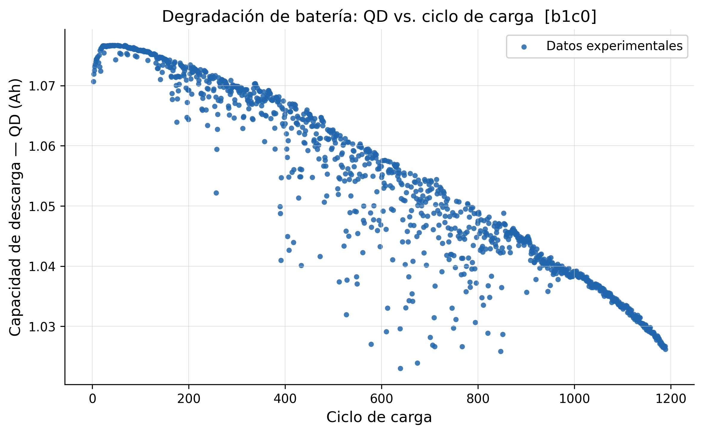
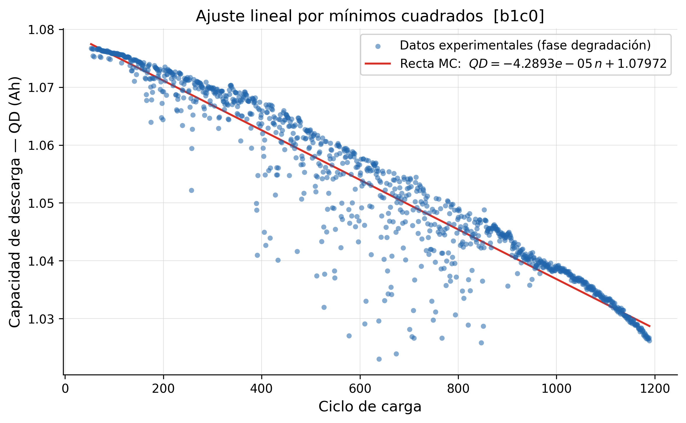

# Aproximación por mínimos cuadrados — Degradación de baterías de litio

**Materia:** Análisis Numérico  
**Dataset:** Ciclado de baterías de litio-ion (`b1c0`)  
**Variables:** Número de ciclo de carga (n) y capacidad de descarga (QD)

---

## a) Descripción del problema

### Contexto

Las baterías de litio-ion pierden capacidad progresivamente a medida que se las cicla: cada vez que se cargan y descargan, sufren degradación electroquímica interna. La métrica estándar para medir esa degradación es la **capacidad de descarga (QD)**, medida en Ah, que indica cuánta energía puede entregar la batería en cada ciclo.

Contar con un modelo matemático que describa esa caída permite:

- Estimar cuántos ciclos le quedan a una batería antes de ser reemplazada.
- Predecir la capacidad en ciclos futuros no medidos.
- Comparar el envejecimiento entre distintas baterías o políticas de carga.

### Datos

| Parámetro | Valor |
|---|---|
| Batería analizada | `b1c0` |
| Ciclos disponibles | 2 – 1189 |
| Puntos de datos (limpios) | 1 165 |
| QD inicial (ciclo 2) | 1,0707 Ah |
| QD pico (ciclo 53) | 1,0767 Ah |
| QD final (ciclo 1189) | 1,0262 Ah |
| Caída total de capacidad | ~4,7 % |

> **Nota — fase de formación:** durante los primeros ~53 ciclos, la capacidad *sube* levemente. Es un fenómeno conocido como fase de formación del SEI (*Solid Electrolyte Interphase*): la capa protectora del ánodo termina de formarse y estabilizarse. A partir del ciclo 53 comienza la degradación real, que es el fenómeno que se modela en este trabajo.

**Variables del modelo:**

- **Variable independiente (x):** número de ciclo de carga, *n* ∈ [53, 1189]
- **Variable dependiente (y):** capacidad de descarga *QD(n)* [Ah]

Para el ajuste se utilizan los **1 120 puntos de la fase de degradación** (ciclos 53–1189), que presentan una tendencia decreciente clara y continua.

### Valor a estimar

Se desea conocer la capacidad de descarga de la batería en el **ciclo 1 300**, valor que no se encuentra en el dataset. Esto representa una extrapolación de ~110 ciclos más allá del último dato registrado, útil para anticipar cuándo la batería llegará a un umbral de reemplazo.

---

## b) Nube de puntos

La siguiente figura muestra la evolución de QD a lo largo de los 1 165 ciclos disponibles. Se puede observar la fase de formación inicial (subida hasta el ciclo 53) seguida de la degradación continua.



> Archivo vectorial de alta calidad: [`graphs/scatter.svg`](graphs/scatter.svg)

---

## c) Ajuste por mínimos cuadrados

Se ajustan tres modelos sobre la fase de degradación (ciclos 53–1189). Para cada uno se detalla el cambio de variables (si aplica), el sistema de ecuaciones normales, su resolución y la función aproximante resultante.

### Modelo 1 — Lineal

$$QD(n) = a \cdot n + b$$

**Ecuaciones normales** (sistema 2×2):

$$\begin{pmatrix} \sum x^2 & \sum x \\ \sum x & n \end{pmatrix} \begin{pmatrix} a \\ b \end{pmatrix} = \begin{pmatrix} \sum x \cdot f(x) \\ \sum f(x) \end{pmatrix}$$

**Sumas calculadas** sobre los 1 120 puntos de la fase de degradación (ciclos 53–1189):

| Símbolo | Valor |
|---|---|
| $n$ | 1 120 |
| $\sum x$ | 697 406 |
| $\sum f(x)$ | 1 179,370970 |
| $\sum x^2$ | 554 612 058 |
| $\sum x \cdot f(x)$ | 729 213,275097 |

**Fórmulas despejadas:**

$$a = \frac{n \cdot \sum x \cdot f(x) - \sum x \cdot \sum f(x)}{n \cdot \sum x^2 - \left(\sum x\right)^2} = \frac{1120 \cdot 729213{,}2751 - 697406 \cdot 1179{,}3710}{1120 \cdot 554612058 - (697406)^2} = \frac{-5781522{,}6}{134790376124}$$

$$b = \frac{\sum f(x) - a \cdot \sum x}{n} = \frac{1179{,}3710 - (-4{,}2893 \times 10^{-5}) \cdot 697406}{1120} = \frac{1209{,}2848}{1120}$$

**Resultado:**

$$\boxed{QD(n) = -4{,}2893 \times 10^{-5} \cdot n + 1{,}07972}$$



---

### Modelo 2 — Cuadrático

$$QD(n) = a_2 \cdot n^2 + a_1 \cdot n + a_0$$

**Ecuaciones normales:** sistema 3×3 extendido del caso lineal con términos $\sum n_i^2$, $\sum n_i^3$, $\sum n_i^4$.

---

### Modelo 3 — Exponencial *(no polinómico)*

$$QD(n) = A \cdot e^{\beta \cdot n}$$

**Linealización:** se aplica logaritmo natural a ambos miembros:

$$\ln(QD) = \ln(A) + \beta \cdot n$$

Con el cambio de variable $Y = \ln(QD)$, $b_0 = \ln(A)$, $b_1 = \beta$, el modelo se convierte en uno lineal:

$$Y(n) = b_1 \cdot n + b_0$$

Se resuelve el sistema de ecuaciones normales del modelo lineal sobre las parejas $(n_i,\ \ln(QD_i))$, y al final se recuperan los parámetros originales: $A = e^{b_0}$, $\beta = b_1$.

---

### Comparación gráfica

*(Se generará en la siguiente etapa del trabajo.)*


---

## d) Comparación y elección del mejor modelo

La comparación se realizará usando el **coeficiente de determinación R²**:

$$R^2 = 1 - \frac{\sum (QD_i - \hat{QD}_i)^2}{\sum (QD_i - \overline{QD})^2}$$

Un R² más cercano a 1 indica mejor ajuste. Se evaluará además si la curva elegida tiene sentido físico para extrapolar al ciclo 1 300.

*(Resultados y análisis se completarán una vez calculados los coeficientes.)*

---

## Estructura del proyecto

```
analisis-numerico/
├── data/
│   └── dataset.csv       # Dataset de ciclado de baterías
├── graphs/
│   ├── scatter.svg / .png          # Nube de puntos
│   └── approximations.svg / .png   # Curvas de ajuste
├── src/
│   └── main.py           # Script principal (scatter + ajustes)
├── requirements.txt
└── README.md
```

## Ejecución

```bash
# Activar entorno virtual
source venv/bin/activate

# Generar gráficos
cd src
python main.py
```
